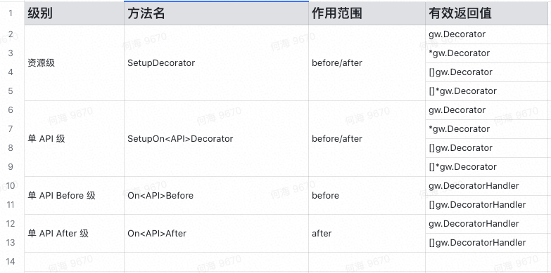

# 装饰器 Decorator

在面向对象的编程中，装饰器模式是一种设计模式，它允许将行为动态地添加到单个对象中，而不会影响同一类中其他对象的行为。

[1]装饰器模式通常可用于遵守 “单一职责原则”，因为它允许在具有唯一关注区域的类之间划分功能。

[2]装饰器模式在结构上与责任链模式几乎相同，区别在于责任链中，只有一个类可以处理请求，而对于装饰器，所有类都可以处理请求。

## Gw 中的 Decorator 实现

gw framework 的 decorator 是在 http request API 级实现的，分为 Before/After 2种装饰器。

Before decorator 会在执行真正的 API 接口之前被执行，After decorator 会在执行真正的 API 接口之后被执行。

### Dynamic Rest-style API's decorator

#### Decorator Scope & Setup



#### Example

Example, 定义的一个 Role 资源的 Rest API

```go
package RestAPI

import (
	"github.com/oceanho/gw"
	"github.com/oceanho/gw/contrib/apps/uap/Const"
	"github.com/oceanho/gw/contrib/apps/uap/Dto"
	"github.com/oceanho/gw/contrib/apps/uap/Service"
)

type Role struct {
}

func (u Role) Name() string {
	return "role"
}

// Role resources global decorators
// 定义/设置 Role 资源的全局 Decorator
func (u Role) SetupDecorator() gw.Decorator {
	return Const.RoleGlobalDecorator
}

//
// rest-style APIs
//
func (u Role) Get(ctx *gw.Context) {

}

// 定义/设置 Get API 的 Before Decorator
func (u Role) OnGetBefore() gw.DecoratorHandler {
    return func(ctx *gw.Context) (status int, err error, payload interface{}){
        // 获取当前的登陆用户
        //author := ctx.User()

        // 这里执行相应的义务逻辑
        return 0, nil, nil
    }
}
```

## 参考资料

1. https://en.wikipedia.org/wiki/Decorator_pattern
